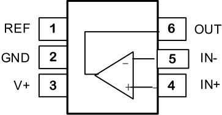

# 1. CH224K

CH224是一款支持PD3.0/2.0，BC1.2等升压快充协议输入的协议电源受电端IC，支持4～22V范围内电压的请求，并可通过多种方式动态配置优先请求的电压档位。在项目开发中，可以通过PD快充诱骗芯片使电源适配器输出固定的电压值，进而给后继设备供电。**在本项目中使用CH224K诱骗输出9V，然后通过Buck降压芯片输出5V，因此电源适配器选用含有9V/3A输出的即可。**

 

 

通过CFG1串联电阻到GND配置输出电压时，CFG2和CFG3引脚可悬空。

  

 

1K限流电阻耗散功率计算：诱骗输出9V，根据数据手册中的描述，VDD的工作电压为3.0V–3.3V。

$I=V/R=(9-3.3)/1000=5.7mA$，$P=I^2R=32.49mW$

0402封装的电阻，额定功率为62.5mW，所以使用0402封装的限流电阻即可。

# 2. 电流检测

TP181与INA199对比：TP181与INA199的引脚、封装、内部结构完全一样，可以直接进行替换。

 

 

## 2.1 INA199简介

INA199 是一款 26V、共模、零漂移拓扑、电流检测放大器，可用于低侧和高侧配置。该器件是一款专门设计的电流检测放大器，可在远超过电源电压的共模电压下精确测量电流检测电阻上产生的电压。可在高达 26V 的输入电压轨上测量电流，并且该器件可由低至 2.7V 的电源电压供电。  

- 宽共模范围：-0.3V到26V
- 失调电压：当运放的放大增益为1时，输出的电压误差。±150uV(最大值)
- 增益选择：50倍、100倍、200倍
- 静态电流：100uA(最大值)
- 可通过配置REF引脚，来设置检测单向或双向电流

  

  

  

**典型应用原理图：**单向电流检测

  

单向模式：将REF接地，没有电流流过时，输出为低电平。当有电流流过时，运放输出电压。

**典型应用原理图：**双向电流检测

  

## 2.2 TP181简介

TP181是一款36V、共模、零漂移拓扑、电流检测放大器，可用于低端和高端配置。

- 最大失调电压：±100uV
- 宽共模电压：-0.3V~36V
- 增益选择：50倍、100倍、200倍

 

    

# 输出过流保护

USB2.0接口最大可以提供500mA的电流输出，USB3.0接口最大可以提供900mA的电流输出，因此设定过流保护为1A。

# 无源晶振负载电容计算

 

- CL：负载电容的值，数据手册中会给出
- C1、C2：需要外接的电容值，C1=C2。
- Cs：电路板的寄生电容，一般取3~5pF

C1=C2，C1的计算公式：

$C_1=(C_L-C_S)*2=(12-3)*2=18pF$，当$C_S=5pF$时，$C_1=14pF$。

因此按照常规标准值，外接电容18pF即可。
